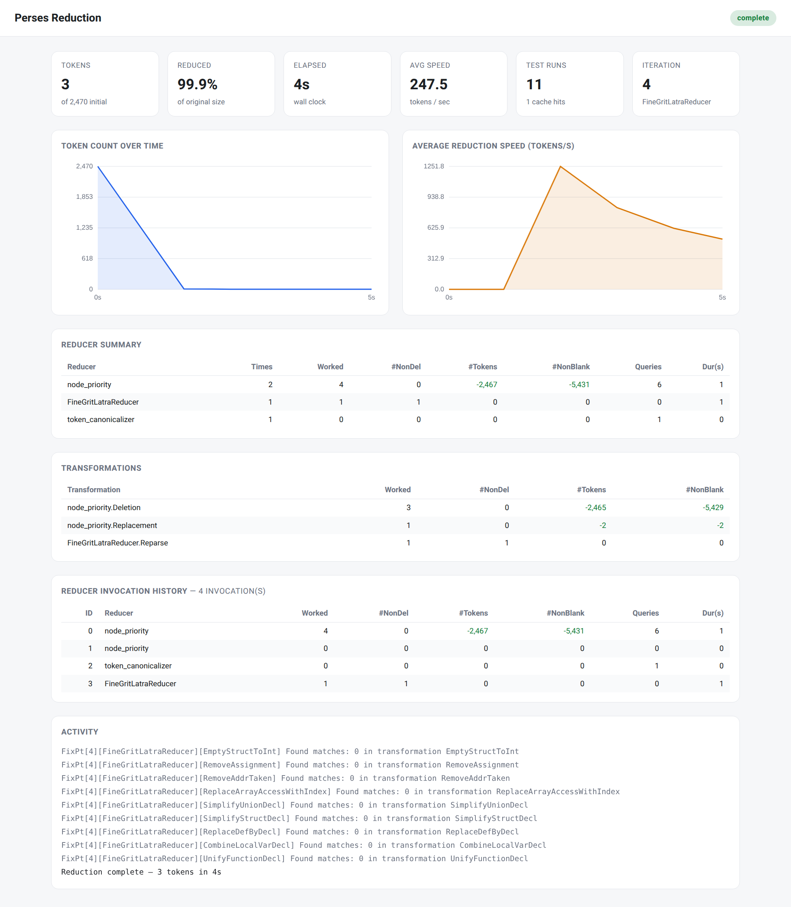

# Perses: Syntax-Directed Program Reduction

Perses is a language-agnostic program reducer to minimize a program with
respect to a set of constraints. It takes as input a program to reduce,
and a test script which specifies the constraints.
It outputs a minimized program which still satisfies the constraints specified
in the test script. Compared to Delta Debugging and Hierarchical Delta Debugging,
Perses leverages the syntax information in the Antlr grammar, and prunes the
search space by avoiding generating syntactically invalid programs.

### Supported Languages

Currently, Perses supports reduction for the following programming languages:

+ c: `*.c`
+ cpp: `*.cc`, `*.cpp`, `*.cxx`
+ glsl: `*.glsl`, `*.comp`, `*.frag`, `*.vert`
+ go: `*.go`
+ jackson-yaml: `*.jackson`, `*.yaml`, `*.yml`
+ java: `*.java`
+ javascript: `*.javascript`, `*.js`
+ line: `*.line`
+ makefile: `*.mk`
+ mysql: `*.mysql`
+ onetoken: `*.onetoken`
+ php: `*.php`
+ python3: `*.py`, `*.py3`
+ ruby: `*.rb`
+ rust: `*.rs`
+ scala: `*.scala`, `*.sc`
+ smtlibv2: `*.smt2`, `*.sy`
+ solidity: `*.sol`
+ sqlite: `*.sqlite`
+ system_verilog: `*.v`, `*.sv`
+ web assembly: `*.wat`, `*.wasm`
+ xml: `*.xml`

Support for other languages is coming soon.

### Obtain and Run

There are three ways to obtain Perses.

- Download a prebuilt release JAR file from our [release page](https://github.com/perses-project/perses/releases),
  for example,

  ```bash
  wget https://github.com/uw-pluverse/perses/releases/download/v2.6/perses_deploy.jar
  java -jar perses_deploy.jar [options]? --test-script <test-script.sh> --input-file <program file>
  ```

- Clone the repo and build Perses from the source.

  ```bash
  git clone https://github.com/perses-project/perses.git
  cd perses
  bazelisk build //src/org/perses:perses_deploy.jar
  java -jar bazel-bin/src/org/perses/perses_deploy.jar [options]? \
      --test-script <test-script.sh> --input-file <program file>
  ```

- If you want to always use the trunk version of Perses, [perses-trunk](https://github.com/perses-project/perses/blob/master/scripts/perses-trunk) automatically downloads and builds the latest version.

  NOTE: [Bazelisk](https://github.com/bazelbuild/bazelisk) is the prerequisite to run perses-trunk successfully.

  ```bash
  wget https://raw.githubusercontent.com/perses-project/perses/master/scripts/perses-trunk
  chmod +x perses-trunk
  ./perses-trunk [options]? --test-script <test-script.sh> --input-file <program file>
  ```

#### Important Flags

- --test-script **&lt;test-script.sh&gt;**:
  The script encodes the constraints that both of the original program file and the reduced version should satisfy. It should return **0** if the constraints are satisfied.

- --input-file **&lt;program-file&gt;**: the program needs to be reduced. Currently, Perses
  supports C, Rust, Java and Go. Note that we can easily support any other languages,
  if the specific language can be parsed by an Antlr parser.

#### Writing a Robust Test Script

The test script is the oracle that drives the entire reduction: Perses copies the
current candidate program into a fresh working directory, runs the script there,
and keeps the candidate only if the script exits **0** (the property of interest
still holds); otherwise the candidate is discarded. The script
must be deterministic and self-contained — read the program from the working
directory (not an absolute path), avoid side effects outside that directory (or
use temp directories and then clean them up), and never block on interactive input.
Reduced variants routinely provoke compiler crashes, infinite loops, and runaway memory,
so the script must defend against a single candidate hanging the whole run.

Guard every external tool with a wall-clock **`timeout`** (e.g.
`timeout -s KILL 10 cc small.c`) so no single invocation can run forever. This
alone is not enough, though: `timeout` signals only the process it launches, not
that process's descendants. Compiler *drivers* such as `gcc` (which forks `cc1`)
or `ccomp` spawn the real worker as a child, and when the driver is killed that
worker is orphaned to `init`/`systemd` and can keep spinning at 100% CPU
indefinitely — leaking one runaway per bad variant until the machine is starved
(dead-but-unreaped descendants pile up as zombies). To close this gap, also set a
per-process CPU cap with **`ulimit -t <seconds>`** near the top of the script:
unlike `timeout`, `RLIMIT_CPU` is inherited by every descendant and enforced by the
kernel regardless of reparenting, so orphaned runaways are reaped automatically.
Pick the cap above the largest per-tool `timeout` (roughly 2×) so legitimate runs
finish while runaways die, and optionally add `ulimit -v` to bound memory. One last
caveat: if a timed-out tool's output feeds a pipe or `$(...)`, the shell can still
block waiting for EOF because a leaked descendant keeps the pipe's write end open —
redirect tool output to a file rather than a pipe when in doubt.

```bash
#!/bin/bash
# CPU-time cap in seconds, inherited by every descendant: an orphaned compiler
# that escaped `timeout` is still reaped by the kernel via RLIMIT_CPU.
ulimit -t 20
# Wall-clock guard on each tool; -s KILL force-kills a wedged process. Redirect to
# a file (not a pipe) so a leaked descendant cannot stall the script on EOF.
timeout -s KILL 10 clang -O2 -c small.c > log.txt 2>&1
grep -q "internal compiler error" log.txt && exit 0   # property holds
exit 1                                                 # property broken
```

#### Live Web Dashboard

Perses can serve a live web dashboard that visualizes a reduction as it runs: the shrinking
token count, the average reduction speed over time, per-reducer statistics, and the history
of reducer invocations (the same statistics Perses prints at the end of a run, but updated in
real time).

Enable it with `--enable-web-ui true`. Perses prints a `http://127.0.0.1:<port>` URL to open in
a browser. Use `--web-ui-port <port>` to pick the port (default `9000`; if it is already in use,
an ephemeral port is chosen and the actual URL is printed).

```bash
java -jar perses_deploy.jar --enable-web-ui true \
    --test-script <test-script.sh> --input-file <program file>
```

The dashboard binds to localhost only. To watch a reduction that is running on a remote machine,
forward the port over SSH, e.g. `ssh -L 9000:127.0.0.1:9000 <remote-host>`, then open
`http://127.0.0.1:9000` locally.



Check all available command line arguments

```bash
java -jar perses_deploy.jar  --help
```

The following is the complete list of command line arguments.

```
Usage: org.perses.Main [options]

[Outputs]  Options:
    --output-dir, -o
      The output directory to save the reduced result.

[Inputs]  Options:
  * --test-script, --test, -t
      The test script to specify the property the reducer needs to preserve.
  * --input-file, --input, -i
      The input file(s) or directory(ies) to reduce. Repeat the flag to pass 
      multiple, e.g. --input a.c --input b.c, or --input src_dir. A directory 
      is expanded recursively to all regular files under it (the test script 
      and any --deps files are excluded).
      Default: []
    --deps
      The dependency file(s) or directory(ies) required for running the 
      property test. A directory is expanded recursively to all regular files 
      under it.
      Default: []

[General Reduction Control]  Options:
    --global-fixpoint
      iterative reduction till fixpoint, globally
      Default: false
    --fixpoint
      iterative reduction till fixpoint, for the main reducer only
      Default: true
    --threads
      Number of reduction threads: a positive integer, or 'auto'.
      Default: auto
    --code-format
      The format of the reduced program.
      Possible Values: [SINGLE_TOKEN_PER_LINE, ORIG_FORMAT, COMPACT_ORIG_FORMAT, PYTHON3_FORMAT, COMPACT_PYTHON3_FORMAT, YAML_FORMAT]
    --script-execution-timeout-in-seconds
      the interval in seconds to timeout the test script executions. the 
      default timeout is 600 seconds.
      Default: 600
    --script-execution-keep-waiting-after-timeout
      keep trying even after the script execution timeouts.
      Default: true

[Output Refining Control]  Options:
    --call-formatter
      call a formatter on the final result
      Default: false
    --format-cmd
      the command to format the reduced source file
      Default: <empty string>
    --call-creduce
      call C-Reduce when Perses is done.
      Default: false
    --creduce-cmd
      the C-Reduce command name or path
      Default: creduce

[Reduction Algorithm Control]  Options:
    --alg
      The main reduction algorithm: use --list-algs to list all available 
      algorithms 
    --cleanup-alg
      The cleanup reduction algorithm, which is the non-first reduction 
      algorithm used in the fixpoint iteration. Use --list-algs to list all 
      available algorithms.
    --list-algs
      list all the reduction algorithms.
    --reparse-each-iteration
      Reparse the program before the start of each fixpoint iteration.
      Default: true
    --enable-token-slicer
      Enable token slicer after syntax-guided reduction is done. Maybe slow.
      Default: false
    --enable-tree-slicer
      Enable tree slicer after syntax-guided reduction, and before token 
      slicer 
      Default: false
    --line-slicer
      whether to run the line slicer (after syntax-guided reduction, before 
      the token slicer): auto (only for files that do not parse under their 
      real grammar), on (every file), or off
      Default: AUTO
      Possible Values: [AUTO, ON, OFF]
    --min-slicing-window-size
      The minimum window size of the windowed slicer.
      Default: 1
    --max-slicing-window-size
      The maximum window size of the windowed slicer.
      Default: 14

[Language Control]  Options:
    --list-langs
      List all the supported languages.
    --lang
      Specify the language of the program that is to be reduced.
      Default: <empty string>
    --parser-facade-class-name
      The parser facade to be used to parse the input program
      Default: <empty string>
    --list-parser-facades
      List all the available parser facades.
    --language-ext-jars
      A list of JAR files to support new languages
      Default: []

[Classical Perses Reducer Control]  Options:
    --default-list-minimizer-for-kleene
      The default list minimizer algorithm to reduce kleene nodes.
      Default: DFS
      Possible Values: [PRISTINE_DDMIN, PERSES_VARIANT_OF_PRISTINE, DFS, BFS, CDD, WEIGHTED_DFS, WEIGHTED_BFS, PROBDD, WDD, WPROBDD, WINDOWED_SLICER, LOCAL_EXHAUSTIVE_PATTERN_ENUMERATION, ONE_BY_ONE, ADAPTIVE_GAIN_DRIVEN]

[Vulcan Reducer Control]  Options:
    --enable-vulcan
      Enable vulcan (using auxiliary reducers to help produce smaller 
      reduction output).
      Default: false
    --non-deletion-iteration-limit
      The maximum number of continuous non-deletion iterations allowed.
      Default: 10
    --window-size
      The window size used to perform local exhaustive pattern reduction.
      Default: 4
    --vulcan-fixpoint
      Enable vulcan fixpoint iteratively using auxiliary reducers until no 
      progress can be made
      Default: false

[T-Rec Reducer Control]  Options:
    --enable-trec
      enable T-Rec (a lexical-syntax guided fine-grained reduction process to 
      reduce and canonicalize each token)
      Default: true

[Profiling]  Options:
    --progress-dump-file
      The file to record the reduction process. The dump file can be large..
    --actionset-effect-profile
      The file to profile the effect of edit action sets.
    --stat-dump-file
      The file to save the statistics collected during reduction.
    --profile-query-cache-time
      The file to save the profiling data of the query cache.
    --profile-query-cache-time-csv
      The file to save the profiling data of the query cache in the CSV 
      format. 
    --profile-query-cache-memory
      The file to save the profiling data of the query cache.
    --profile-actionset
      The file to save information of all the created edit action sets.
    --profile-list-minimizer
      The file to save the reduction process of the list minimizer.
    --profile-program-size-trend
      The file to save the the size of the program being reduced over time.
    --profile-for-reduction-progress-differential-analysis
      The file to save the reduction process for offline differential 
      analysis. 
    --enable-web-ui
      Serve a live web dashboard of the reduction progress on localhost.
      Default: false
    --web-ui-port
      Preferred port for --enable-web-ui. Falls back to an ephemeral port if 
      taken. 
      Default: 9000

[Cache Control]  Options:
    --query-caching
      Enable query caching for test script executions.
      Default: true
    --default-sha-alg-type
      The SHA algorithm used in the reduction process
      Default: SHA256
      Possible Values: [SHA512, SHA256]

[List Minimizer Microbenchmarking]  Options:
    --list-minimizer-microbenchmarking-mode
      RECORD captures each list minimization problem encountered. EVALUATE 
      runs one minimizer against one recorded problem and reports its cost and 
      result. Unset (the default) runs a normal reduction.
      Possible Values: [RECORD, EVALUATE]
    --list-minimizer-microbenchmark-output
      RECORD: the directory to write recorded microbenchmarks to, one folder 
      each. 
    --min-list-size-to-record
      RECORD: skip problems whose list is shorter than this. Lists of one or 
      two elements leave a minimizer no room to differ, so they say nothing 
      about which one to prefer.
      Default: 6
    --max-microbenchmarks-to-record
      RECORD: stop recording after this many microbenchmarks. Unset means no 
      bound. 
    --evaluation-microbenchmark
      EVALUATE: the microbenchmark.yaml of the recorded problem to evaluate.
    --evaluation-minimizer
      EVALUATE: the list minimizer to evaluate. Exactly one per invocation.
      Possible Values: [PRISTINE_DDMIN, PERSES_VARIANT_OF_PRISTINE, DFS, BFS, CDD, WEIGHTED_DFS, WEIGHTED_BFS, PROBDD, WDD, WPROBDD, WINDOWED_SLICER, LOCAL_EXHAUSTIVE_PATTERN_ENUMERATION, ONE_BY_ONE, ADAPTIVE_GAIN_DRIVEN]
    --evaluation-output
      EVALUATE: the directory to write the metrics CSVs to.

[Experiment Control]  Options:
    --keep-reduction-history
      keep all the reduction folders generated during reduction
      Default: false
    --enable-error-tolerant-grammar
      when a file does not parse under its real grammar, first try an 
      error-tolerant parse of that grammar (keeping its structure, with 
      unparseable fragments as leaf tokens) before falling back to the 
      Dyck/Line tolerant grammars
      Default: true
    --dyck-node-reducer
      whether to run the Dyck node reducer as an extra pass that reparses each 
      file under a Dyck grammar and deletes balanced delimiter groups the real 
      grammar cannot place: auto (only for files that do not parse under their 
      real grammar), on (every file), or off
      Default: AUTO
      Possible Values: [AUTO, ON, OFF]

[LPR Reducer Control]  Options:
    --enable-lpr
      Enable LPR (LLM-based transformations to improve reduction results).
      Default: false
    --lpr-fixpoint
      Enable lpr fixpoint. Everytime a transformation makes progress, go to 
      the next transformation.
      Default: false
    --llm-client-script
      The executable script used to invoke the LLM during LPR. It receives a 
      JSON request (via --input-file) and writes a JSON array of response 
      strings (via --output-file). If omitted, LPR falls back to a bundled 
      default client (lpr/scripts/llm_client.py): an OpenAI-compatible client 
      that by default targets a local ollama server at 
      http://localhost:11434/v1 with model codellama:13b. The fallback is 
      reported in the reduction output when it is used.

[Latra Reducer Control]  Options:
    --enable-latra
      Enable Latra (language-specific transformations to produce smaller 
      reduction output).
      Default: true
    --latra-fixpoint
      Enable fixpoint mode for running Latra reducers.
      Default: true
    --latra-transformation-list-minimizer
      The list minimizer algorithm to reduce with the found transformations
      Default: WPROBDD
      Possible Values: [PRISTINE_DDMIN, PERSES_VARIANT_OF_PRISTINE, DFS, BFS, CDD, WEIGHTED_DFS, WEIGHTED_BFS, PROBDD, WDD, WPROBDD, WINDOWED_SLICER, LOCAL_EXHAUSTIVE_PATTERN_ENUMERATION, ONE_BY_ONE, ADAPTIVE_GAIN_DRIVEN]

[Verbosity]  Options:
    --verbosity
      verbosity of logging
      Default: INFO
    --list-verbosity-levels
      list all verbosity levels
    --hide-timestamps
      hide the timestamps in the log messages
      Default: false

[Version]  Options:
    --version
      print the version

[Help]  Options:
    -h, --help
      print help message

```

### License

GNU General Public License 3.

### Publication 

This repository contains the implementations of the techniques proposed in the following papers.

#### 1. Perses: Syntax-Guided Program Reduction (ICSE 2018, [pdf](./doc/publication/2018_perses_icse.pdf))

```
@inproceedings{perses,
  author = {Sun, Chengnian and Li, Yuanbo and Zhang, Qirun and Gu, Tianxiao and Su, Zhendong},
  title = {Perses: Syntax-Guided Program Reduction},
  year = {2018},
  publisher = {Association for Computing Machinery},
  doi = {10.1145/3180155.3180236},
  booktitle = {Proceedings of the 40th International Conference on Software Engineering},
  pages = {361–371},
}
```

#### 2. Pushing the Limit of 1-Minimality of Language-Agnostic Program Reduction (OOPSLA 2023, [pdf](./doc/publication/2023_vulcan_oopsla.pdf))

```
@article{perses-vulcan,
  title={Pushing the Limit of 1-Minimality of Language-Agnostic Program Reduction},
  author={Xu, Zhenyang and Tian, Yongqiang and Zhang, Mengxiao and Zhao, Gaosen and Jiang, Yu and Sun, Chengnian},
  journal={Proceedings of the ACM on Programming Languages},
  volume={7},
  number={OOPSLA1},
  pages={636--664},
  year={2023},
  publisher={ACM New York, NY, USA}
}
```

#### 3. PPR: Pairwise Program Reduction (ESEC/FSE 2023, [pdf](./doc/publication/2023_ppr_fse.pdf), [doc](./ppr/README.md))

```
@inproceedings{perses-ppr,
  title={PPR: Pairwise Program Reduction},
  author={Zhang, Mengxiao and Xu, Zhenyang and Tian, Yongqiang and Jiang, Yu and Sun, Chengnian},
  booktitle={Proceedings of the 31st ACM Joint European Software Engineering Conference and Symposium on the Foundations of Software Engineering},
  pages={338--349},
  year={2023}
}
```

#### 4. Ad Hoc Syntax-Guided Program Reduction (ESEC/FSE Tool 2023, [pdf](./doc/publication/2023_adhoc_fse_tool.pdf))

```
@inproceedings{10.1145/3611643.3613101,
  author = {Tian, Jia Le and Zhang, Mengxiao and Xu, Zhenyang and Tian, Yongqiang and Dong, Yiwen and Sun, Chengnian},
  title = {Ad Hoc Syntax-Guided Program Reduction},
  year = {2023},
  publisher = {Association for Computing Machinery},
  doi = {10.1145/3611643.3613101},
  booktitle = {Proceedings of the 31st ACM Joint European Software Engineering Conference and Symposium on the Foundations of Software Engineering},
  pages = {2137–2141},
}
```

#### 5. On the Caching Schemes to Speed Up Program Reduction (TOSEM, [pdf](./doc/publication/2023_caching_tosem.pdf))

```
@article{perses-caching,
  title={On the Caching Schemes to Speed Up Program Reduction},
  author={Tian, Yongqiang and Zhang, Xueyan and Dong, Yiwen and Xu, Zhenyang and Zhang, Mengxiao and Jiang, Yu and Cheung, Shing-Chi and Sun, Chengnian},
  journal={ACM Transactions on Software Engineering and Methodology},
  volume={33},
  number={1},
  pages={1--30},
  year={2023},
  publisher={ACM New York, NY, USA}
}
```

#### 6. LPR: Large language models-aided program reduction (ISSTA 2024, [pdf](./doc/publication/2024_lpr_issta.pdf))

```
@inproceedings{perses-lpr,
  title={LPR: Large Language Models-Aided Program Reduction},
  author={Zhang, Mengxiao and Tian, Yongqiang and Xu, Zhenyang and Dong, Yiwen and Tan, Shin Hwei and Sun, Chengnian},
  booktitle={Proceedings of the 33rd ACM SIGSOFT International Symposium on Software Testing and Analysis},
  pages={261--273},
  year={2024}
}
```

#### 7. T-Rec: Fine-Grained Language-Agnostic Program Reduction Guided by Lexical Syntax (TOSEM, [pdf](./doc/publication/2024_trec_tosem.pdf))

```
@article{perses-trec,
  title={T-Rec: Fine-Grained Language-Agnostic Program Reduction Guided by Lexical Syntax},
  author={Xu, Zhenyang and Tian, Yongqiang and Zhang, Mengxiao and Zhang, Jiarui and Liu, Puzhuo and Jiang, Yu and Sun, Chengnian},
  journal={ACM Transactions on Software Engineering and Methodology},
  year={2024},
  publisher={ACM New York, NY}
}
```

#### 8. WDD: Weighted Delta Debugging (ICSE, [pdf](./doc/publication/2025_wdd_icse.pdf))

```
@article{perses-wdd,
  title={WDD: Weighted Delta Debugging},
  author={Zhou, Xintong and Xu, Zhenyang and Zhang, Mengxiao and Tian, Yongqiang and Sun, Chengnian},
  booktitle={Proceedings of the 47th International Conference on Software Engineering},
  year={2025},
  doi = {10.1109/ICSE55347.2025.00071},
  publisher = {IEEE Computer Society},
}
```

#### 9. Toward a Better Understanding of Probabilistic Delta Debugging (ICSE, [pdf](./doc/publication/2025_cdd_icse.pdf))

```
@article{perses-cdd,
  title={Toward a Better Understanding of Probabilistic Delta Debugging},
  author={Zhang, Mengxiao and Xu, Zhenyang and Tian, Yongqiang and Cheng, Xinru and Sun, Chengnian},
  booktitle={Proceedings of the 47th International Conference on Software Engineering},
  year={2025},
  doi = {10.1109/ICSE55347.2025.00117},
  publisher = {IEEE Computer Society},
}
```

#### 10. Boosting Program Reduction with the Missing Piece of Syntax-Guided Transformations (OOPSLA, [pdf](./doc/publication/2025_sfc_oopsla.pdf))

```
@article{perses-sfc,
  title={Boosting Program Reduction with the Missing Piece of Syntax-Guided Transformation},
  author={Xu, Zhenyang and Tian, Yongqiang and Zhang, Mengxiao and Sun, Chengnian},
  journal={Proceedings of the ACM on Programming Languages},
  year={2025},
  doi = {10.1145/3763053},
  publisher = {Association for Computing Machinery},
}
```

#### 11. Latra: A Template-Based Language-Agnostic Transformation Framework for Effective Program Reduction  (ASE, [pdf](./doc/publication/2025_latra_ase.pdf))

```
@article{perses-latra,
  title={Latra: A Template-Based Language-Agnostic Transformation Framework for Effective Program Reduction},
  author={Xu, Zhenyang and Wang, Yiran and Tian, Yongqiang and Zhang, Mengxiao and Sun, Chengnian},
  booktitle={Proceedings of the 40th IEEE/ACM International Conference on Automated Software Engineerin},
  year={2025},
  doi = {},
  publisher = {},
}
```
### Acknowledgement

This project has been/was partially supported by NSERC Discovery, a project under
WHJIL Lab, and CFI-JELF Project #40736. 

The codebase was optimized with an open source license from [JProfiler](https://www.ej-technologies.com/jprofiler).  